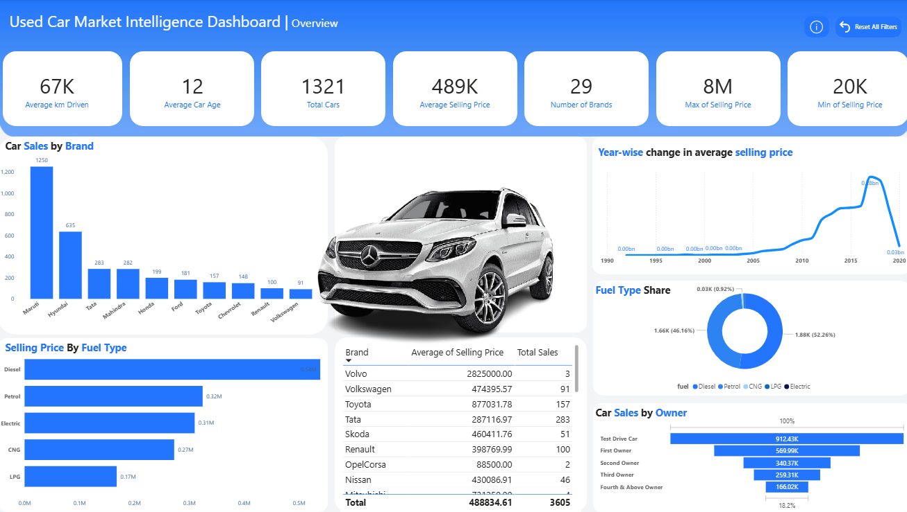

# UCMI – Used Car Market Intelligence

This project applies data cleaning, feature engineering, and Python-based exploratory analysis to understand used car market trends, culminating in an interactive dashboard that visualizes key insights such as pricing patterns, brand performance, and fuel type distribution.

> **Status:** Work in progress – the analytics pipeline is in place, and the dashboard is being finalized.


---

## Dashboard Preview



---

## Project Description

### Used Car Market Intelligence  – Project Description

This project delivers end-to-end insights into the used car industry by building a complete data analytics pipeline—from raw data preprocessing to a fully interactive, business-ready dashboard. The solution consolidates market variables such as brand, manufacturing year, mileage, fuel type, ownership status, and selling price to reveal pricing behaviors, brand performance, and consumer trends.

#### 1. Data Collection & Cleaning

The original dataset included multiple attributes describing used vehicles. To ensure high-quality and consistent data, extensive preprocessing steps were applied:

- Handling missing and inconsistent values  
- Correcting numerical and categorical data types  
- Removing duplicates and filtering outliers (e.g., unrealistic mileage or selling prices)  
- Standardizing categorical labels such as brand names and fuel types  

These procedures ensured the dataset was accurate, structured, and ready for meaningful analysis.

#### 2. Feature Engineering

Additional analytical value was created through derived attributes, enabling deeper market interpretation:

- **Car Age** based on manufacturing year  
- **Price segmentation** (minimum, maximum, and average selling price) by brand and fuel type  
- **Mileage categories** to identify consumer preferences and pricing benchmarks  
- **Ownership classification** to compare demand for first-owner vs. multi-owner cars  

These features enhanced model explainability and provided granular business insights.

#### 3. Exploratory Data Analysis (EDA)

Using Python (Pandas, NumPy, Matplotlib, Seaborn), a comprehensive EDA was performed to understand valuation patterns, demand indicators, and market behaviors. Key findings included:

- Top-selling brands in the used car market  
- Distribution of selling prices across brands, fuel types, and ownership tiers  
- Temporal pricing trends illustrating changes in market value over the years  
- Dominant fuel types, with petrol and diesel vehicles leading demand  

This phase served as the analytical backbone for dashboard visualization and strategic interpretation.

#### 4. Interactive Dashboard

A professional **Used Car Market Intelligence Dashboard** was developed to convert data insights into actionable, real-time intelligence. Key components include:

- **KPIs:** Total cars analyzed, average age, mileage, fuel distribution, and average selling price  
- **Brand Insights:** Comparison of car sales volume and pricing across manufacturers  
- **Fuel Type & Ownership Visualizations:** Market share and buyer trends  
- **Year-wise Pricing Trends:** Historical valuation trajectories  
- **Brand Performance Table:** Aggregated sales volume and average pricing metrics  

The dashboard empowers dealers, investors, analysts, and buyers to identify profitable opportunities, benchmark pricing, and forecast trends.

#### Outcome

The project demonstrates robust capabilities in **data engineering, exploratory analytics, feature derivation, and dashboard design**. By integrating all steps—from raw data cleaning to interactive visualization—the solution provides a comprehensive and scalable framework for market intelligence in the used car sector.

---

## Repository Structure

High-level layout of the project:

```text
UCMI/
├─ data/                               # All dataset files
│  ├─ car_data.csv                     # Original raw dataset
│  ├─ car_data_cleaned.csv             # Cleaned dataset after preprocessing
│  └─ cars_processed.csv               # Fully processed dataset
│
├─ notebooks/                          # Jupyter notebooks for each pipeline stage
│  ├─ 01_data_cleaning.ipynb           # Data preparation and cleaning
│  ├─ 02_feature_engineering.ipynb     # Feature creation and transformations
│  └─ 03_EDA_visuals.ipynb             # Exploratory data analysis and visualizations
│
├─ outputs/                            # Generated artifacts
│  ├─ screenshots/                     # Dashboard screenshots
│  ├─ Dashboard.pbix                   # Power BI dashboard file
│  └─ Presentation.pdf                 # Final project presentation
│
├─ README.md                           # Project documentation
└─ requirements.txt                    # Python dependencies
```
---
## Installation & Setup

Follow the steps below to set up your environment and run the project.

---

### 1. Clone the Repository
```bash
git clone https://github.com/engalaagabr/UCMI.git
cd UCMI
```
### 2.Create a Virtual Environment (Recommended)
```bash
python -m venv venv

# macOS / Linux
source venv/bin/activate

# Windows
venv\Scripts\activate
```
---
### 3. Install Project Dependencies

All required libraries are listed in requirements.txt.
```bash
pip install -r requirements.txt
```
---
THX
